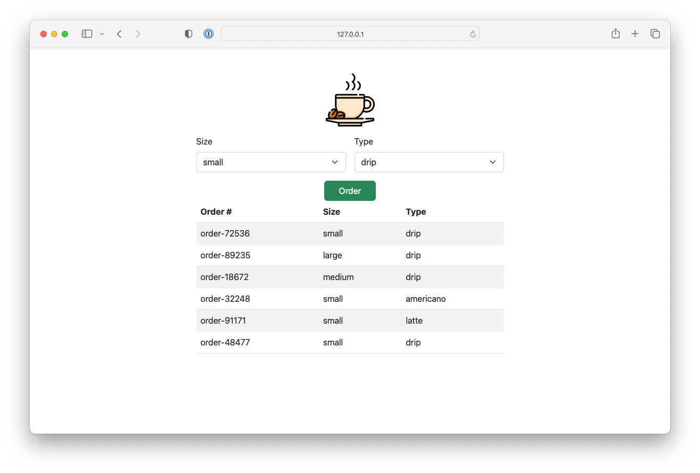

# Coffee Order
A dummy Node.js application that allows you to send coffee orders that get stored in a Redis cache.



## Requirements
- Node.js >= v18.11.0
- Redis Server

## Run Locally
Install required packages:
```bash
npm install express redis pug
```

Start the Redis server:
```bash
redis-server --requirepass testing123 --port 6379
```

In another terminal, start the Node.js server:
```bash
node src/main.js
```

> sample output
```bash
Turning on espresso machine
Connecting to Redis at 127.0.0.1:6379
Serving on port 3000
Connected to Redis
```

In your browser, go to: http://127.0.0.1:3000

## Run in Cloud Foundry
```bash
cf push
```